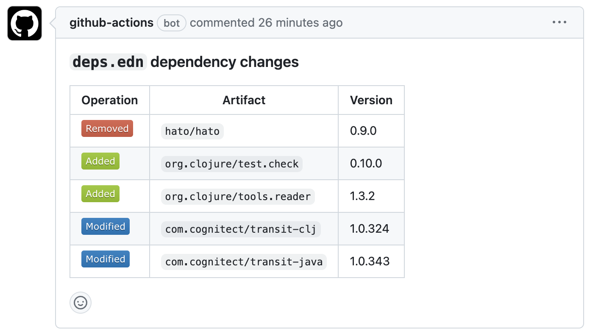

# deps-diff

A tool for comparing transitive dependencies in two deps.edn files.

Certainly, the Clojure ecosystem does not strictly follow SemVer ([Spec-ulation](https://www.youtube.com/watch?v=oyLBGkS5ICk&t=2789s)),
and if there are no concrete benefits, it is recommended not to update dependencies.
However, when it becomes necessary to replace an artifact, you need to be extremely careful,
especially when implicit transitive dependencies change, as compatibility issues may arise.

For example, consider the following dependency tree:

```
+-----+     +--------+     +--------+
|  A  | --> | B(1.0) | --> | C(1.0) |
+-----+     +--------+     +--------+
      \     +--------+     +--------+
       +--> | D(1.0) | --> | C(1.0) |
            +--------+     +--------+
```

Let's assume a situation where we need to update dependency B:

```
+-----+     +--------+     +--------+
|  A  | --> | B(2.0) | --> | C(2.0) |
+-----+     +--------+     +--------+
      \     +--------+     +--------+
       +--> | D(1.0) | --> | C(1.0) |
            +--------+     +--------+
```

In this scenario, B internally updated C to 2.0. If we haven't explicitly specified the version of C,
there is no way to guarantee that D will work correctly (See [Dep selection](https://clojure.org/reference/dep_expansion#_dep_selection)).

But it's good to know that such potential risks can be detected in advance.
`deps-diff` is a GitHub Action created for this purpose.


## Example

Just create a `.github/workflows/deps-diff.yml` file as follows.

```yml
name: Notify dependency diff

on:
  pull_request:
    paths:
      - 'deps.edn' # only watch this

jobs:
  notify:
    runs-on: ubuntu-latest
    steps:
      - name: Diff dependencies
        id: diff
        uses: namenu/deps-diff@main
        with:
          format: markdown
          aliases: "[:test]"

      - uses: marocchino/sticky-pull-request-comment@v2
        if: ${{ steps.diff.outputs.exit_code != 0 }}
        with:
          header: deps-diff # Creates a collapsed comment with the report
          message: |
            ### `deps.edn` dependency changes

            ${{ steps.diff.outputs.deps_diff }}
```

This workflow will comment on your PR as shown below.




## Inputs

| Name        | Description                                                                                                                  | Default Value               |
|-------------|------------------------------------------------------------------------------------------------------------------------------|-----------------------------|
| `base`      | The git sha before the change being referenced. The default value is the git ref of the base branch of the PR.               | Git ref of PR's base branch |
| `format`    | Determines the format of the output. You can specify `edn`, `markdown`, or `cli`. The default value is edn                   | `edn`                       |
| `aliases`   | Specifies the aliases to be used when forming the basis. It must be expressed as a quoted sequence (e.g., `'[:dev :test]'`). | `nil`                       |
| `project`   | Specifies the path of the `deps.edn` file.                                                                                   | `deps.edn`                  |


## Outputs

- `deps_diff` - The name of the outlet where the execution result is output. Use it along with the action's id in your workflow.
- `exit_code` - 0 if equal or else 1.


## Run as a tool

```bash
# install
clojure -Ttools install io.github.namenu/deps-diff '{:git/sha "##version##"}' :as deps-diff`

# resolve base deps
clojure -X:deps tree :project '"test-resources/base/deps.edn"' :aliases '[:dev]' :format :edn > __base.edn
# resolve target deps
clojure -X:deps tree :project '"test-resources/target/deps.edn"' :aliases '[:dev]' :format :edn > __target.edn

# then compare
clojure -Tdeps-diff namenu.tools.deps-diff/diff :base '"__target.edn"' :target '"__target.edn"' :format :cli
```

